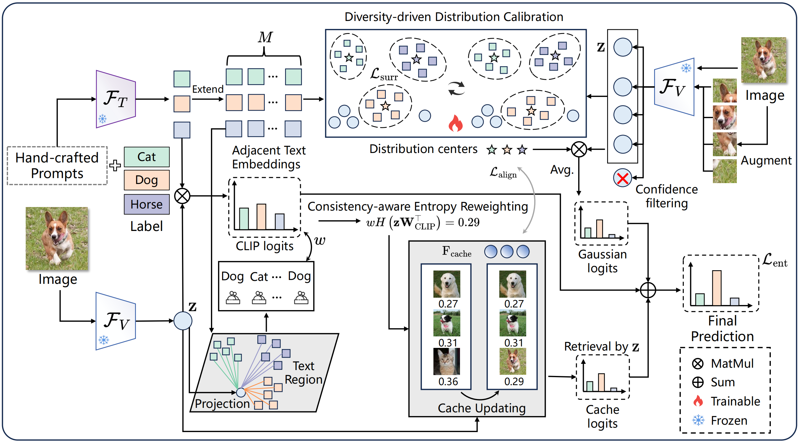

# ReTA
🎉  Our paper **"Advancing Reliable Test-Time Adaptation of Vision-Language Models under Visual Variations"** has been accepted at **ACM MM 2025**!

🔗**Link**: [https://arxiv.org/abs/2507.09500](https://arxiv.org/abs/2507.09500)

### 📚 Overview

<p align="center">
  
</p>

### 🛠️ Environment

```bash
conda create -n reta python=3.8 -y
conda activate reta

pip install torch==1.12.1+cu116 torchvision==0.13.1+cu116 torchaudio==0.12.1 --extra-index-url https://download.pytorch.org/whl/cu116

pip install -r requirements.txt
```

### 🗂️ Datasets

Please follow [DATASETS.md](https://github.com/kdiAAA/TDA/blob/main/docs/DATASETS.md) to prepare the datasets and annotations.

Our dataset organization example is as follows:

```
TTA_Data/
├─ imagenet/
│  ├─ classnames.txt
│  └─ images/
│     └─ val/
├─ imagenet-adversarial/            
│  ├─ classnames.txt
│  └─ imagenet-a                             
├─ imagenet-rendition/           
│  ├─ classnames.txt    
│  └─ imagenet-r
├─ imagenet-sketch/         
│  ├─ classnames.txt         
│  └─ images/
├─ imagenetv2/
│  ├─ classnames.txt 
│  └─ imagenetv2-matched-frequency-format-val  


├─ caltech-101/
│  ├─ split_zhou_Caltech101.json
│  └─ 101_ObjectCategories/
├─ dtd/
│  ├─ split_zhou_DescribableTextures.json
│  ├─ images/
│  └─ labels/                       
├─ eurosat/
│  ├─ split_zhou_EuroSAT.json
│  └─ 2750/
├─ fgvc_aircraft/
│  ├─ images/
│  └─ images_variant_test.txt                       
├─ food-101/
│  ├─ images/
│  └─ split_zhou_Food101.json                         
├─ oxford_flowers/
│  ├─ jpg/
│  ├─ imagelabels.mat                   
│  ├─ cat_to_name.json  
│  └─ split_zhou_OxfordFlowers.json      
├─ oxford_pets/
│  ├─ split_zhou_OxfordPets.json
│  ├─ images/
│  └─ annotations/                  
├─ stanford_cars/
│  ├─ cars_test/
│  └─ split_zhou_StanfordCars.json
├─ sun397/
│  ├─ SUN397/
│  └─ split_zhou_SUN397.json                   
└─ ucf101/
   ├─ UCF-101-midframes/                       
   └─ split_zhou_UCF101.json                 

```


### 🚀 Quick Start

To reproduce the results reported in **Tables 1** and **Table 2** of our paper, run the following commands:

```bash
# OOD benchmark (ViT-B/16)
bash ./scripts/run_ood_benchmark_vit.sh

# OOD benchmark (RN50)
bash ./scripts/run_ood_benchmark_rn50.sh

# Cross-domain benchmark (ViT-B/16)
bash ./scripts/run_cd_benchmark_vit.sh

# Cross-domain benchmark (RN50)
bash ./scripts/run_cd_benchmark_rn50.sh
```
Hyperparameter configurations are in `configs/`. In these config files, `align` corresponds to $\lambda_2$ and train_w corresponds to $\lambda_1$ in Eq. (18). For other hyperparameters, please refer to [TDA](https://github.com/kdiAAA/TDA) and [DPE](https://github.com/zhangce01/DPE-CLIP/tree/main).

### 🤗 Acknowledgements

Our work benefited from the public code and dataset instructions of [TPT](https://github.com/azshue/TPT), [CoOp](https://github.com/KaiyangZhou/CoOp), [TDA](https://github.com/kdiAAA/TDA) and [DPE](https://github.com/zhangce01/DPE-CLIP/tree/main). Thanks to the authors for open-sourcing implementations and providing clear setup guides.

### 📌 Citation

If you find this code helpful, kindly consider citing: 

```
@article{liang2025advancing,
  title={Advancing Reliable Test-Time Adaptation of Vision-Language Models under Visual Variations},
  author={Liang, Yiwen and Chen, Hui and Xiong, Yizhe and Zhou, Zihan and Lyu, Mengyao and Lin, Zijia and Niu, Shuaicheng and Zhao, Sicheng and Han, Jungong and Ding, Guiguang},
  journal={arXiv preprint arXiv:2507.09500},
  year={2025}
}
```